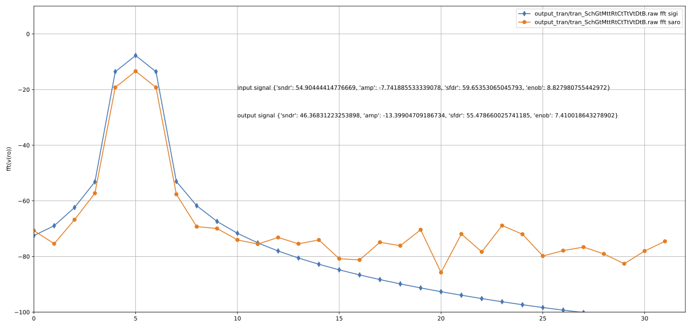

# 9-bit successive approximation analog-to-digital converter

A description of the ADC can be found in [A Compiled 9-bit 20-MS/s
3.5-fJ/conv.step SAR ADC in 28-nm FDSOI for Bluetooth Low Energy
Receivers](https://ieeexplore.ieee.org/document/7906479), which describes an
implementation of this ADC in 28-nm FDSOI.

This is the same ADC ported to skywater 130nm.

The sources for the ADC are

``` bash
cic
├── ip.json                      # Object file, describes the object hierarchy of the circuits in the SAR
├── ip.spi                       # Spice file, describes the connectivity 
├── capacitor.json               # Object file for capacitors
├── dmos_sky130nm_core.json      # Object file for transistors
└── sky130.tech                  # Technology file for Skywater 130 nm
```


# Compiling ADC

The SAR is pre-compiled, so you don't really need to compile it. The compiled files are
in the `design/` directory, so if all you want is to simulate on a SAR, then
`design/SUN_SAR9B_SK130NM.spice` should suffice.

To compile the ADC you need

- Compiler [ciccreator](https://github.com/wulffern/ciccreator)
- Transpiler [cicpy](https://github.com/wulffern/cicpy)

and you need to modify the Makefile to point to the right installation of `cic`
and `cic.py`

Then you can do

``` bash
cd work
make ip
```

# Running simulation

Seems like ngspice > 37 is necessary to run the SAR.

You need [cicsim](https://github.com/wulffern/cicsim) to run the
simulations.

If you think everything is installed, then try 

``` bash
cd sim/SAR9B
make test 
```

# Testbenches

| Name              | Purpose                                                       | Notes                                      |
|:------------------|---------------------------------------------------------------|--------------------------------------------|
| sim/SAR9B/tran.spi          | Full simulation of SAR, takes 1.5 hours on my Macbook pro     | python3 plot.py <runfile> to plot FFT      |


# Results




# TODO
- LVS only works with a flat hierarchy


