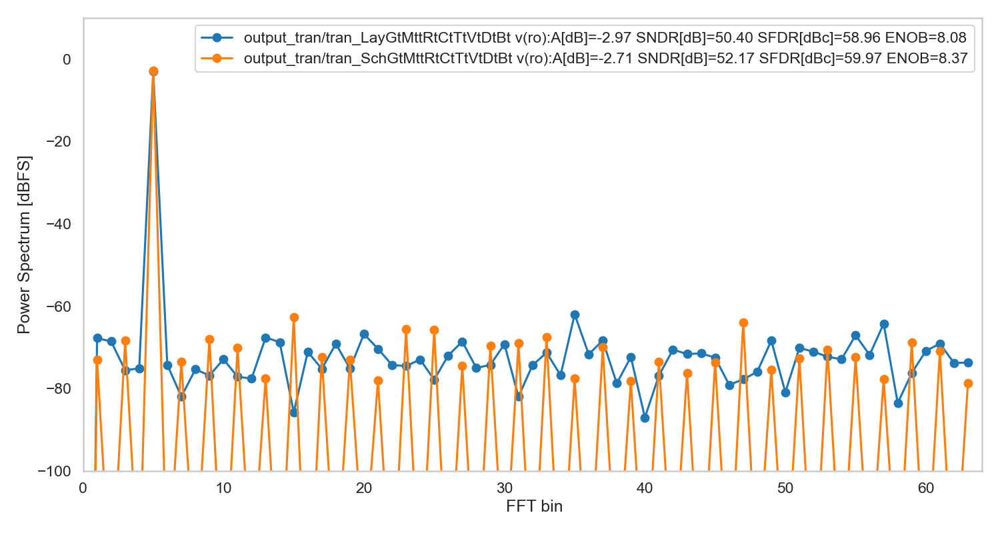
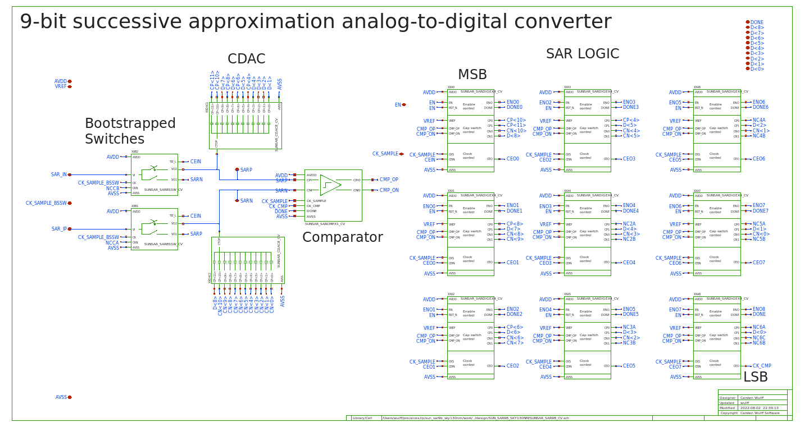

# SUN_SAR9B_SKY130NM

# Who
Carsten Wulff carsten@wulff.no

# Why
Many years ago I made a compiler, and a state-of-the-art compiled ADC in 28 nm
FDSOI, described in [A Compiled 9-bit 20-MS/s
3.5-fJ/conv.step SAR ADC in 28-nm FDSOI for Bluetooth Low Energy
Receivers](https://ieeexplore.ieee.org/document/7906479). Since then, I've
ported the ADC to multiple closed PDKs (22 nm FDSOI, 22 nm, 28 nm, 55 nm, 65 nm and
130nm). Finally, there is an open source port to skywater 130nm!

# How
Made with [ciccreator](https://github.com/wulffern/ciccreator) and
 [cicpy](https://github.com/wulffern/cicpy).
 
The sources for the ADC are

``` bash
cic
├── ip.json                      # Object file, describes the object hierarchy of the circuits in the SAR
├── ip.spi                       # Spice file, describes the connectivity 
├── capacitor.json               # Object file for capacitors
├── dmos_sky130nm_core.json      # Object file for transistors
└── sky130.tech                  # Technology file for Skywater 130 nm
```

 
# What
| What               | Path                                   | Comment          |
|:-------------------|:---------------------------------------|:-----------------|
| Schematic          | [design/SUN_SAR9B_SKY130NM/SUNSAR_SAR9B_CV.sch](design/SUN_SAR9B_SKY130NM/SUNSAR_SAR9B_CV.sch) | Not fully tested |
| Layout             | [design/SUN_SAR9B_SKY130NM/SUNSAR_SAR9B_CV.mag](design/SUN_SAR9B_SKY130NM/SUNSAR_SAR9B_CV.mag) |                  |
| Verilog            | [design/SUN_SAR9B_SKY130NM.v](design/SUN_SAR9B_SKY130NM.v)            | Not tested       |
| Simulation netlist | [design/SUN_SAR9B_SKY130NM.spice](design/SUN_SAR9B_SKY130NM.spice)        |                  |
| LVS netlist        | [design/SUN_SAR9B_SKY130NM.spi](design/SUN_SAR9B_SKY130NM.spi)          |                  |


# Compiling ADC
The SAR is pre-compiled, so you don't really need to compile it. The compiled files are
in the `design/` directory, so if all you want is to simulate on a SAR, then
`design/SUN_SAR9B_SKY130NM.spice` should suffice.

To compile the ADC you need

- Compiler [ciccreator](https://github.com/wulffern/ciccreator)
- Transpiler [cicpy](https://github.com/wulffern/cicpy)

and you need to modify the Makefile to point to the right installation of `cic`
and `cic.py`

Then you can do

``` bash
cd work
make ip
```

# Running simulation

Seems like ngspice > 37 is necessary to run the SAR.

You need [cicsim](https://github.com/wulffern/cicsim) to run the
simulations.

If you think everything is installed, then try 

``` bash
cd sim/SAR9B
make test 
```

# Testbenches

| Name              | Purpose                                                       | Notes                                      |
|:------------------|---------------------------------------------------------------|--------------------------------------------|
| sim/SAR9B/tran.spi          | Full simulation of SAR, takes 1.5 hours on my Macbook pro     | python3 plot.py <runfile> to plot FFT      |


# Key parameters
| Parameter                             | Min  | Typ     | Max   | Unit |
|:--------------------------------------|:----:|:-------:|:-----:|:----:|
| Technology                            |      | SKY130NM |       |      |
| AVDD                                  | 1.7  | 1.8     | 1.9   | V    |
| Temperature                           | -40  | 27      | 125   | C    |
| Sampling frequency 25% DTC CK_SAMPLE |      |         | 8     | MHz  |
| Average current AVDD                  |      | 68      |       | uA   |
| Average current VREF                  |      | 34      |       | uA   |
| Power consumption                     |      | 183     |       | uW   |
| SNDR without device noise             | 48.8 | 50.4    | 50.87 | dBFS |
| SFDR                                  | 57   | 59      | 61    | dBc  |
| ENOB without device noise             | 7.8  | 8.08    | 8.16  | bit  |


# Status

| Stage                | TYPE | Status             | Comment |
|:---------------------|:----:|:------------------:|:-------:|
| Specification        | DOC  | :white_check_mark: |         |
| Verilog model        | VIEW | :x:                |         |
| Schematic            | VIEW | :x:                |         |
| Schematic simulation | VER  | :x:                |         |
| Spice simulation     | VER  | :white_check_mark: |         |
| Layout               | VIEW | :white_check_mark: |         |
| LPE simulation       | VER  | :white_check_mark: |         |
| LVS                  | VER  | :white_check_mark: |         |
| DRC                  | VER  | :white_check_mark: |         |
| ERC                  | VER  | :x:                |         |
| ANT                  | VER  | :x:                |         |


# Results




# TODO
- LVS only works with a flat hierarchy
- Caps in SARBSSW are a bit wide
- Add walden FOM extraction





